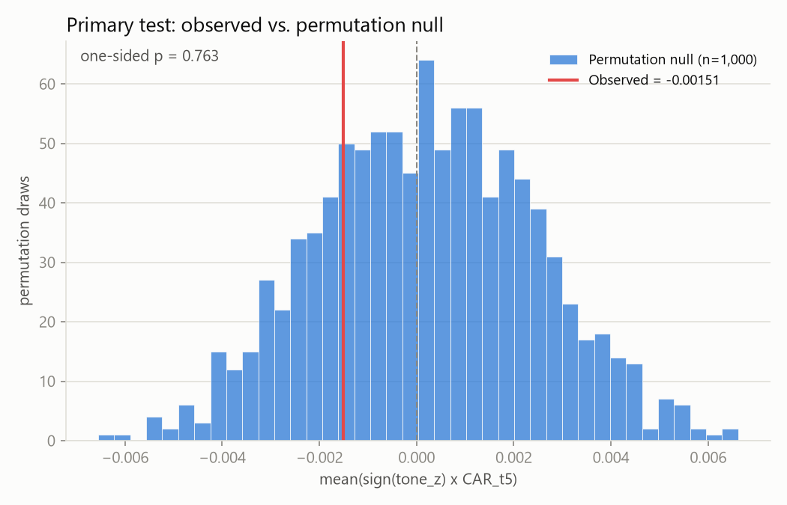
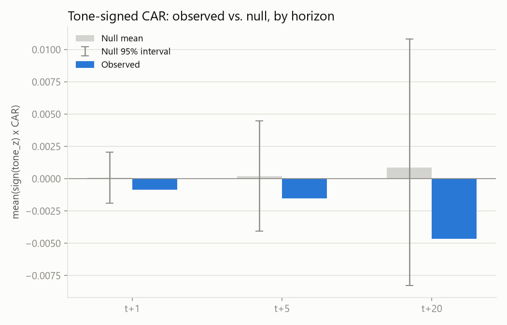
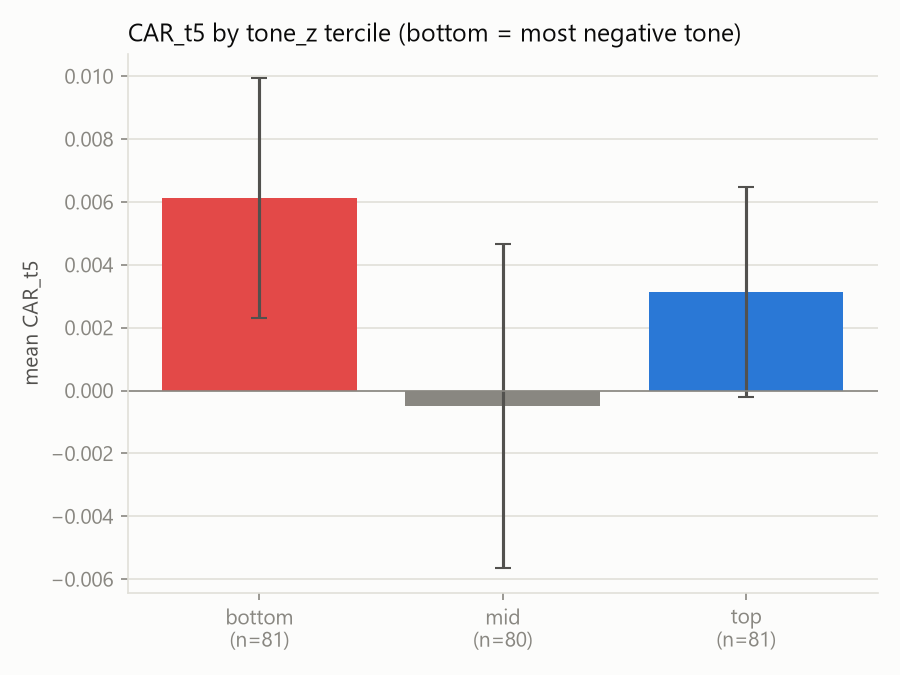

# Obscura Intel

A pre-registered event study testing whether news-volume spike events in NSE
mid/small-cap names carry abnormal forward returns, in the direction of news
tone.

**Verdict: NULL.** No detectable edge under this specification. See
[Results](#results) below — this is a full, honest answer, not a failure to
fix. The pipeline engineering and the pre-registration discipline are the
actual deliverable here, not a trading signal (see [Why this
project](#why-this-project)).

---

## The question

> Given an observable news event now, does the stock exhibit abnormal
> returns afterwards, with direction predicted by tone?

The original framing behind this project — "every stock move has an event
behind it" — is retrodictive and untestable: post-hoc narrative matching is
free and worthless, and a large share of major price moves have no
identifiable news driver at all. The version above is the only falsifiable,
forward-running claim available, so it's the only one this study tests.

**Why NSE mid/small caps, specifically:** obvious news on large liquid names
is priced in milliseconds by HFT and vendor NLP. GDELT updates in 15-minute
batches with lag, so any residual edge from this pipeline's information
diffusion would have to live where attention is thin — lower-coverage,
lower-liquidity names. If no effect exists there, it likely doesn't exist
anywhere this pipeline could reach, and that's what the result below says.

## Design

- **Universe**: 38 NSE mid/small-cap tickers from the Nifty Midcap 100 +
  Smallcap 100 (July 2026 vintage), filtered for distinctive company names,
  spread across 21 distinct sector labels (well above the ≥6 minimum), and
  judged likely to have full price history. Two originally-selected tickers (SAIL, BHEL) were dropped after
  persistent GDELT fetch failures — a data-availability issue, not a universe
  redesign. Full list: [`data/universe.csv`](data/universe.csv).
- **Events**: `vol_z(t) = (v_t - mean_90(t)) / std_90(t)` on trailing 90-day
  GDELT article-volume history; an event day is `vol_z >= 3` and `v_t >= 5`
  articles, with consecutive event-day runs merged to the first day.
  `tone_z(t)` computed identically on the tone series; event direction is
  `sign(tone_z)`. **242 events** across 28 tickers — well above the
  pre-registered 150-event confirmatory gate, so the pre-registered fallback
  threshold was never needed.
- **Entry rule**: close of the first NSE trading day strictly after the
  event's UTC date. Nothing from the event day itself is ever used as a
  tradeable price — GDELT timelines are UTC calendar days and NSE closes
  before the UTC day ends, so the event day partially post-dates the close.
- **Returns**: market model (OLS vs `^NSEI`) over a 120-trading-day
  estimation window ending 21 trading days before entry; every one of the
  242 events had a full, uninterrupted 120-observation window (no
  market-adjusted fallback was needed). `AR_t = r_stock,t - (alpha + beta *
  r_mkt,t)`; `CAR(h)` cumulates `AR` over the first `h` trading days after
  entry, at `h = 1, 5, 20`.
- **Inference**: primary test is a one-sided permutation test (1,000 seeded
  draws) on `mean(sign(tone_z) x CAR_t5)` — pseudo-events are drawn per
  ticker from that ticker's trading days, excluding a ±5-day buffer around
  its real events, holding the ticker's real tone values fixed while
  randomizing timing. Six secondary tests (tone-signed CAR at t+1/t+20,
  |CAR| vs null at each horizon, tone-tercile spread at t+5) go through
  Benjamini-Hochberg FDR correction at q=0.10. A pre-registered robustness
  pass (market-adjusted returns; drop >3-simultaneous-ticker days) runs once,
  after the primary/secondary results were already recorded — no
  respecification.

Full design lock: [`PREREGISTRATION.md`](PREREGISTRATION.md), committed at
[`96b9c1e`](https://github.com/vivektmurali/obscura-intel/commit/96b9c1e)
before any event data was joined to price data.

## Results

**Primary test — FAIL.** `mean(sign(tone_z) x CAR_t5) = -0.00151`, one-sided
permutation p = 0.763 (threshold p < 0.05). The point estimate isn't just
non-significant — it has the *wrong sign* relative to the thesis.



**No secondary test survives BH-FDR** at q=0.10 (best: reaction-magnitude at
t+1, p = 0.238). The pattern is consistent across every horizon tested:



Splitting events into tone terciles makes the "wrong sign" finding visible
directly: the **most negative**-tone tercile has the *highest* mean CAR_t5,
not the lowest.



**Robustness pass** (pre-registered, one pass): dropping high-simultaneity
calendar days doesn't apply — the maximum simultaneity in this dataset was
exactly 3 tickers/day, never exceeding the >3 threshold, so there was nothing
to drop. A market-adjusted-returns comparison lands at p = 0.833. Neither
changes the conclusion.

**Verdict, per the pre-registered kill criterion (`PREREGISTRATION.md`):
"no detectable edge under this specification."** No respecification is
permitted now that results have been seen — this stands as the answer. Full
numeric detail: [`results/stats.json`](results/stats.json).

## Case studies

Three of the largest volume spikes, qualitatively checked against real
headlines (`data/event_samples.csv`):

- **[Biocon, 2023-07-04](https://www.financialexpress.com/healthcare/pharma-healthcare/biocon-biologics-biosimilar-of-humira-is-now-available-in-united-states/3154596/)**
  — Humira biosimilar US launch + acquisition talks. Positive tone, and the
  stock *did* move with it: CAR_t1 +0.61%, CAR_t5 +1.74%. Consistent with
  the thesis.
- **[Bharat Forge, 2025-10-16](https://www.thehindubusinessline.com/companies/rolls-royce-inks-agreement-with-bharat-forge-for-manufacture-of-fan-blades-for-its-pearl-10x-engines/article70171144.ece)**
  — Rolls-Royce engine-parts manufacturing deal. Positive tone, CAR_t5
  +3.42%, CAR_t20 +11.31%. Also consistent — though a 20-day window this
  large is exactly the kind of anecdote that needs the permutation null to
  check whether it's signal or noise (it's one event among 242).
- **[NHPC, 2025-05-05](https://www.firstpost.com/explainers/pahalgam-terror-attack-aftermath-baglihar-water-flow-kishanganga-dam-india-pakistan-13885565.html)**
  — India-Pakistan Indus Waters Treaty tension over dam water flows.
  **Negative** tone (a geopolitical conflict story), but the stock *rose*:
  CAR_t1 +1.86%, CAR_t5 +1.08%, CAR_t20 +2.89%. Wrong-direction — this is
  the kind of case that drags the aggregate signal toward (and past) zero.

These three are illustrative, not evidence either way on their own — that's
exactly why the study relies on the permutation test across all 242 events
rather than reading tea leaves from individual cases.

## Limitations

- **Survivorship bias**: the universe is drawn from *current* Nifty
  Midcap/Smallcap 100 constituents, not the constituents as of 2023. Delisted
  or demoted names are invisible to this study. Disclosed, not fixed, in v0.1.
- **Name-string entity matching is blunt.** GDELT matching is an exact-phrase
  string match on the company name, not true entity resolution. The
  qualitative spot-check (`DECISIONS.md`, Phase 2) found 2-3 of the 20
  largest spikes were contaminated by generic multi-company market-roundup
  articles rather than company-specific news — a real, observed failure
  mode, not just a theoretical one.
- **Cross-sectional clustering**: market-wide news days can inflate apparent
  significance by making events non-independent. The pre-registered
  robustness pass (dropping >3-simultaneous-ticker days) found nothing to
  drop in this dataset, but the underlying risk — and the fact that a
  properly powered version would need calendar-time portfolio methods
  (parked for v0.2) — remains.
- **Single market, single benchmark**: NSE only, `^NSEI` only. Beta mismatch
  between mid/small caps and a large-cap-heavy benchmark is a real, disclosed
  simplification.
- **GDELT coverage bias**: GDELT's crawl favors certain outlets and
  languages; Phase 1's coverage gate confirmed adequate volume (median 104.5
  nonzero-volume days/year across the universe) but doesn't guarantee even
  coverage across sectors or story types.
- **Two tickers (SAIL, BHEL) dropped** after persistent, unexplained GDELT
  fetch failures across three retry passes, including one where they were
  fetched first and in isolation — ruling out simple rate-limit queue
  position as the cause. Root cause undetermined; see `DECISIONS.md`.

## What v0.2 would test

- Calendar-time portfolio methods to properly handle cross-sectional
  clustering instead of the event-time approach used here.
- True entity resolution instead of exact-phrase string matching, to remove
  the market-roundup contamination documented above.
- A point-in-time universe (constituents as of each historical date) to
  remove survivorship bias.
- Extending beyond NSE to test whether the "thin attention → residual edge"
  hypothesis holds in other markets with different HFT/vendor-NLP saturation.

None of the above is in scope for v0.1 — see `PARKING.md` for the full list
of parked ideas, and `HANDOVER.md` §5 for the binding ban list this project
operated under.

## Why this project

This repo is portfolio evidence for UK data/statistics roles (ONS
Statistical Methodologist, DBT Python Developer). The audience cares about
method quality — pre-registration, null controls, multiple-testing
correction, honest limitations — not Sharpe ratios. **A well-executed null
result is a full success for that purpose.** The discipline of committing
`PREREGISTRATION.md` before joining event data to price data, running a real
permutation null instead of eyeballing significance, and reporting the
result exactly as it came out — including a wrong-signed point estimate —
demonstrates exactly the evaluation rigor those roles hire for.

## Repository layout

```
scripts/
  00_smoke_gdelt.py      Phase 0: GDELT API smoke test
  01_coverage.py         Phase 1: universe + coverage audit
  02_events.py           Phase 2: tone fetch + event detection + headline sampling
  03_prices.py           Phase 3: yfinance price pull + integrity report
  04_event_study.py      Phase 4: market-model CARs
  05_inference.py        Phase 5: permutation null + verdict
  06_figures.py          Phase 6: report figures
data/                    universe, events, coverage/integrity reports (raw/ gitignored)
results/                 car_by_event.csv, stats.json, null_distributions.csv, figures/
HANDOVER.md              binding research design + standing execution rules
PREREGISTRATION.md       locked design, committed before any event-price join
DECISIONS.md             running log of every non-obvious implementation choice
PARKING.md               out-of-scope ideas, parked until v0.1 shipped
```

Owner: Vivek Murali
